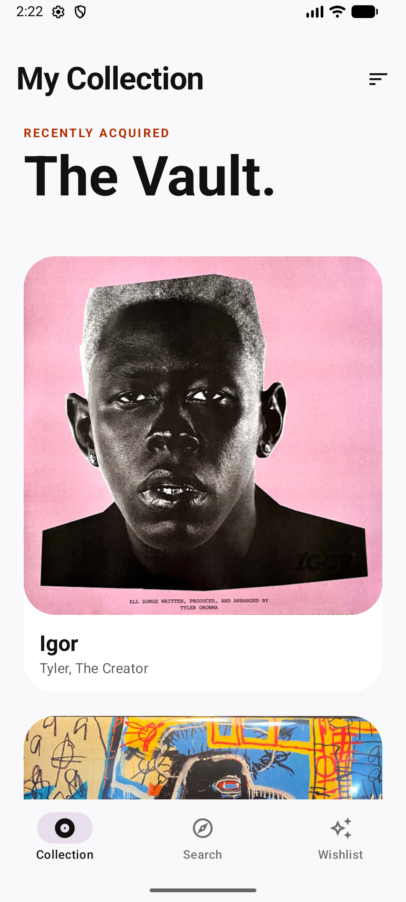
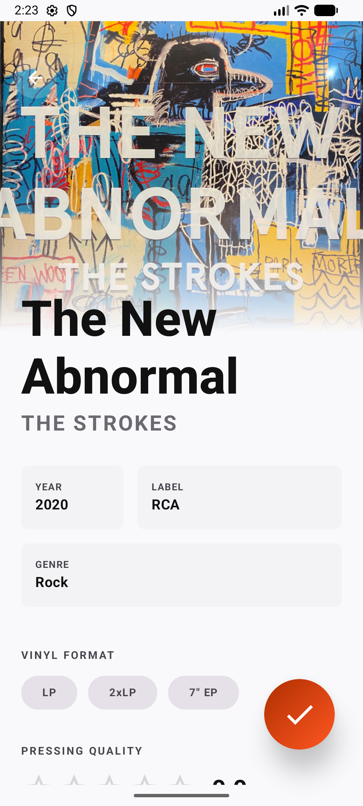
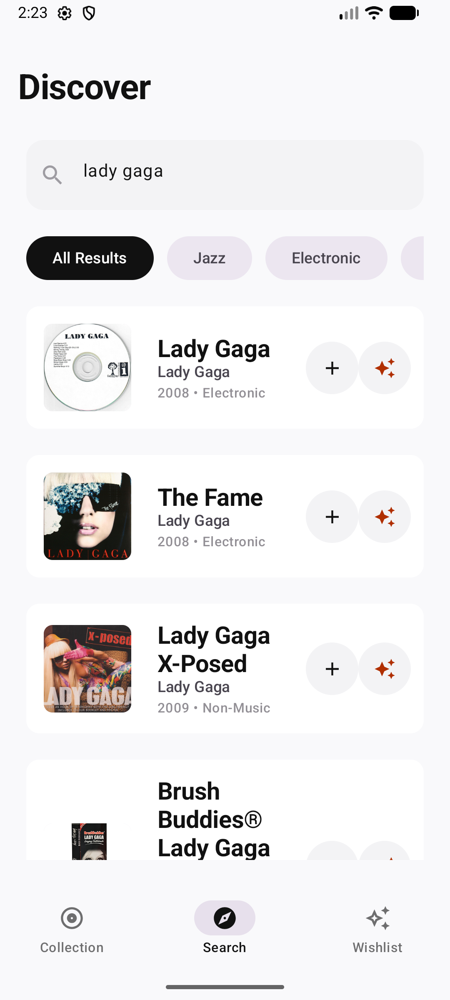
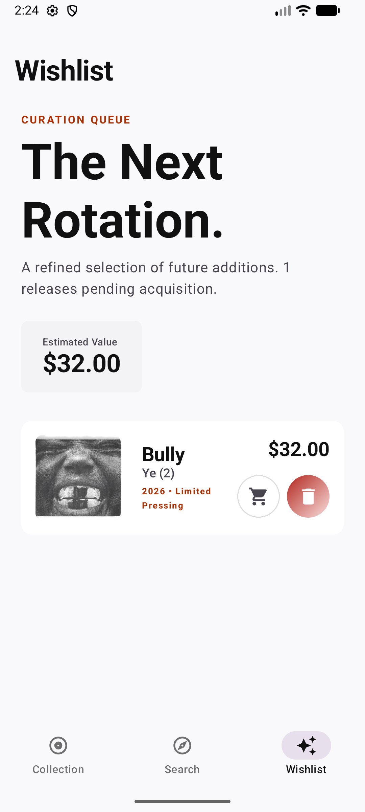
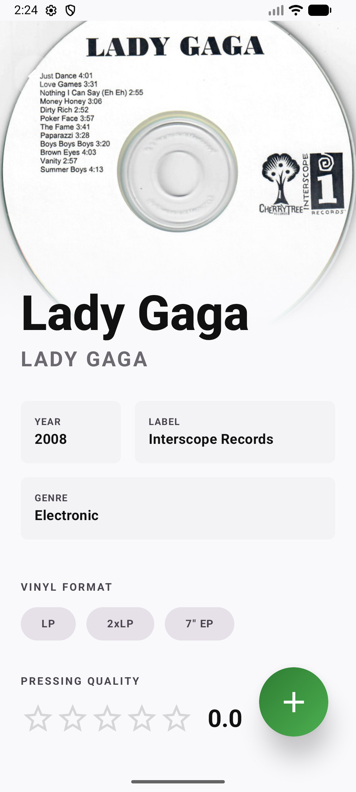

# Vinyl Catalog

## Документация проекта
Техническую документацию вы можете найти в нашем [Wiki-разделе](https://github.com/Silkfinik/vinyl-catalog-app/wiki).

## Description
**Vinyl Catalog** - Android-приложение, созданное для аудиофилов и коллекционеров винила. Проект использует открытый API крупнейшей базы данных Discogs, позволяя легко находить, агрегировать и категоризировать музыкальные релизы.

Ключевые возможности:
* **The Vault (Коллекция):** Просмотр вашей собственной коллекции с умной сортировкой (по названию, дате добавления, году выпуска) и возможностью удаления свайпом.
* **Discover (Поиск):** Интеграция с Discogs API для поиска пластинок. Поддерживается "живой" поиск с фильтрацией по основным жанрам (Rock, Electronic, Jazz).
* **Wishlist (Список желаемого):** Возможность откладывать интересные релизы в корзину с подсчетом ценности и мгновенным трансфером в основную коллекцию.

## Installation
Для того чтобы запустить проект локально, следуйте данной инструкции:

1. Склонируйте репозиторий:
   ```bash
   git clone https://github.com//vinyl-catalog.git
   cd vinyl-catalog
   ```
2. Подготовьте API ключ Discogs:
   * Зарегистрируйтесь на сайте [Discogs](https://www.discogs.com) и сгенерируйте `Personal Access Token` в настройках разработчика.
3. Отредактируйте файл настроек:
   * В корневой папке проекта найдите или создайте файл `local.properties`.
   * Добавьте в него строку:
     ```properties
     DISCOGS_API_TOKEN="ВАШ_ТОКЕН_ОТ_DISCOGS"
     ```
4. Откройте проект в **Android Studio**.
5. Нажмите `Sync Project with Gradle Files`, а затем кнопку **Run** для установки приложения на эмулятор или реальное устройство.

## Usage
Приложение построено на основе интуитивной навигации Material 3.

* **Навигация:** Внизу находится прозрачный стеклянный Navigation Bar. Нажимайте на иконки чтобы переключаться между Коллекцией, Поиском и Списком Желаемого.
* **Добавление в коллекцию:** На экране **Discover**, открыв интересующую пластинку, нажмите оранжевую кнопку `FAB` с иконкой закладки — релиз попадет в ваш Wishlist или Коллекцию.
* **Сортировка:** В верхнем меню **My Collection** нажимайте на иконку линий, чтобы вызвать выпадающее меню с опциями сортировки по датам и тайтлам.







## Contributing
Silkfinik & vvltoria